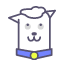
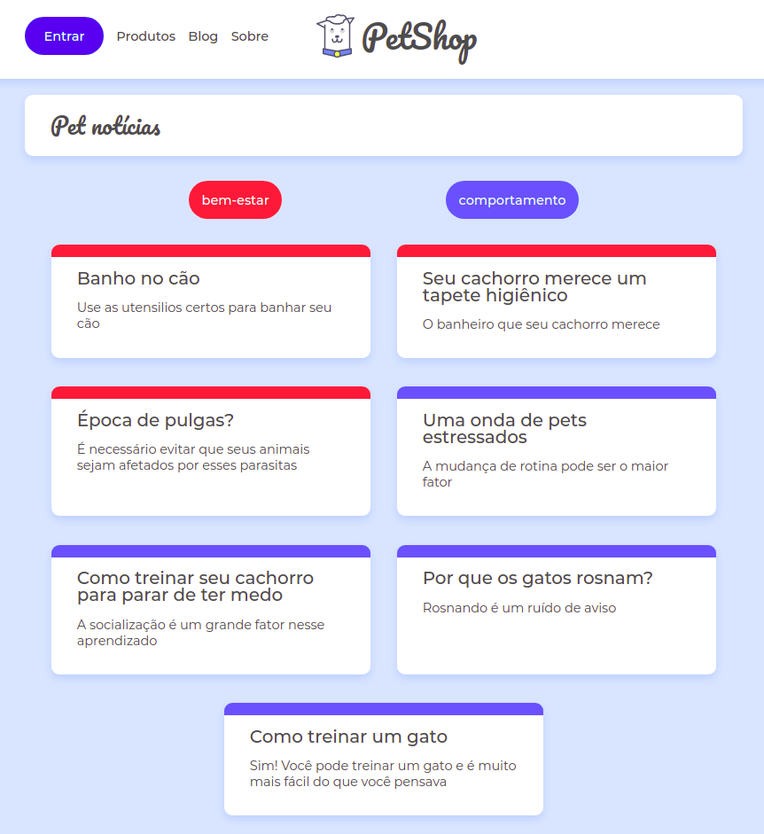

# Sobre o Doguito!
 

O blog do doguito foi criado para tirar diversas dúvidas sobre o mundo pet.

# Sobre o Doguito!

Esse projeto foi criado em um treinamento on-line recentemente, onde usamos o Framewrok React e o conceito de navegação em um SPA(Single Page Application).

## Os framework e as tecnologias utilzadas nesse projeto foram:

- NodeJS : Pode ser definido como um ambiente de execução JavaScript server-side.

- ReactJS : Uma biblioteca JavaScript para criar interfaces de usuário.

- Json-Server : Um pacote que pode ser instalado via npm, que você pode usar para criar um Webservice Rest Json simulando uma API.

- Axios: é um cliente HTTP baseado em Promises para fazer requisições. Pode ser utilizado tanto no navegador quando no Node.js.

- Eslint: É um ferramenta de análise que inclui a correção automática de problema no código digitado.

- Prettier: É uma ferramenta de formatação de código opinativo.

## Como usar:

Para clonar e executar este projeto, você vai precisar do Git, Node.js + Yarn ou Npm instalado no seu computador.

Na sua linha de comando:

### Instalando a API

#### Clone este repositório
$ git clone https://github.com/afschagas/petshop.git

####  Vá para o repositório
$ cd petshop

#### Instale dependênicias
$ yarn install or npm install

#### Iniciar o Servidor
$ json-server --watch db.json -p 3001

#### Rodando na porta 3001

### Instale o Front-end

#### Clone este repositório
$ git clone https://github.com/afschagas/petshop.git

####  Vá para o repositório
$ cd petshop

#### Instale dependênicias
$ yarn install or npm install

#### Run
$ yarn start or npm start

#### Rodando na porta 3000
